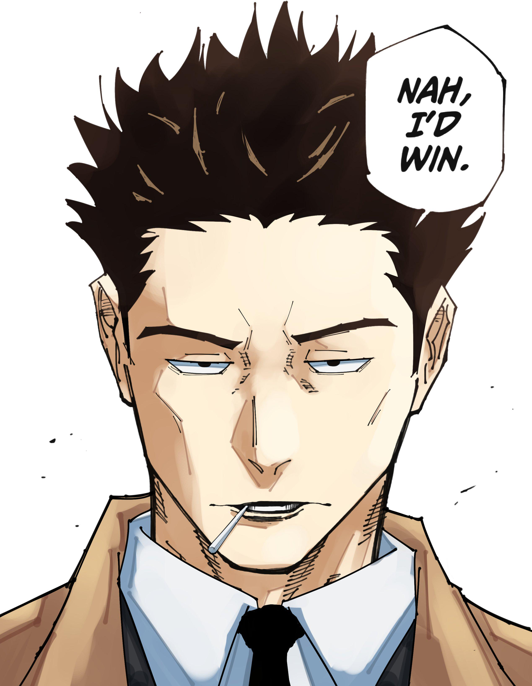

# **Kusakabe**

* ## **Registro Geral**
    **Carregamento de Chakra:** +5 de Chakra  
    **Deslocamento:** 8 Metros (5 + Destreza)  
    **Dano do Soco:** 1d4 (Nível 1)  
    **PA's:** 4º  
    **Idade:** 37 anos  
    **Nível:** 08  
    **Clã:** Senju (16 Pontos)  
    **Habilidade Inata:** -  
    **Classe:** Guerreiro  
    **Alinhamento:**   
    **Ryõ:** 30 Ryou  
    **Elemento:** -  

* ## **Vida e Chakra**
    | Kusakabe | HP ((8 + Cons/2 + 1) x level) | CP 5 + ((8 + 1) x level) |                        
    | :--: | :--:  | :--: |
    | **Atual**| 72 | 77 |
    |**Máximo**| 72  | 77 |

* ## **Atributos**
    | NIN | TAI | GEN | INT | DES | CON | CAR |
    | :--: | :--:  | :--:  | :--:  | :--: | :--:  | :--:  | 
    | 0 | +1 | +0 | +1 | +3 | +1 | +3 |

* ## **Defesas Ninja (DN)**
    | DN | Nin | Tai | Gen | Int | Des | Con | Contra-Ataque | Ajuda |  
    | :--: | :--: | :--: | :--: | :--: | :--: | :--: | :--: | :--: |                  
    |**Inicial**| 8 | 6 | 8 | 9 | 6 | 10 | 4 | 6 |  
    | **Final**| - | 7 | - | 10 | 9 | 11 | 7 | 9 |
  
    #### **Técnicas de DN's**
    **Ninjutsu¹:** -  
    **Ninjutsu²:** -  
    **Taijutsu:** Desvio  
    **Inteligência:** Genjutsu Kai (Dissipação de Genjutsu)  
    **Constituição:** Absorver Dano  
    **Destreza:** Arma Corpo-a-Corpo  
    **Genjutsu:** -  
    **Contra-ataque:** -  
    **Ajuda:** -  

* ## **Especializações (+1 de mod)**
    #### Prestidigitação (Destreza): 3
     Sempre que você tentar realizar um ato de prestidigitação ou de trapaça manual, como plantar alguma coisa em outra pessoa ou esconder um objeto em sua roupa, você deve fazer um teste de Prestidigitação. O Mestre também pode pedir um teste de Prestidigitação para determinar se você pode roubar uma bolsa de moedas ou pegar algo do bolso de outra pessoa.

* ## **Talentos - (4 PC)**
  * #### **UM PASSO A FRENTE - (3 PC)**

  * #### **CHAKRA ELEVADO - (1/2 PC)**

* ## **Itens (4,5 Kg/5 kg)**
  * **Espada** Dano: 1d8; Corpo-a-Corpo; 250 Ryõ; 500g  

* ## **Perícia**
  #### **Perícia no Uso de Armas (1x)**  
  **Garante:** Aumenta 250g por PA de arremesso ou 500g no seu limite de carregamento.   
  **Se obtida uma vez:** As ações de embainhar e desembainhar armas corpo-a-corpo agora custam 0 PA.  

* ## **Talentos de Perícia**

* ## **Upgrade de Clã**
   * **Rank C:** Dominio Simples
   * **Rank B:** -
   * **Rank A:** -
   * **Rank S:** -

* ## **Treinos**
  ### **Treino de Level 6 (Treino Longo; 1 de Inteligência; Rank C) (86 Pontos)**
  * 4º PA (60 PT)
  * Aprender rank C (24 PT) ("Hijutsu Ishibari (Técnica Secreta Agulha de Pedra)")
  * 2x Horas complementares (1 PT) (+15 Ryõ)

* # **Jutsus**
    * ## **Ninjutsus**
   ### **Henge no Jutsu (Técnica de Transformação)**  
   **Custo:** 2 de Chakra por Turno  
   **Rank:** D  
   **Efeito:** Concentração. O jutsu consiste em transformar tanto o ninja quanto um objeto. Dando qualquer outra forma física, como objetos, animais e outras pessoas. Não pode ser usado como defesa. Qualquer doujutsu ou técnica sensorial consegue identificar a transformação.  
   **Dano:** -  
   **Requerimentos:** -  
   **Range:** -  
   **Requerimentos:** -  
   **Aprendizado:** C  
   **Custo de Ações:** 2 PA para ativar  

    ### **Kawarimi no Jutsu (Técnica de Substituição de Corpo)**  
    **Custo:** 4 de Chakra  
    **Rank:** D  
    **Efeito:** *Defesa.* Substitui o corpo do ninja por um toco de madeira ou qualquer outro objeto do cenário. Reaparece numa distância de 1m do local onde estava.  
    **Dano:** -  
    **Requerimentos:** -  
    **Range:** -  
    **Custo de Ações:** Turno de Defesa  

    ### **Kinobiri**  
    **Custo:** -  
    **Rank:** D  
    **Efeito:** Habilita o ninja a andar em superfícies inclinadas. Não utiliza selos de mão.  
    **Dano:** -  
    **Requerimentos:** -  
    **Range:** -  
    **Custo de Ações:** -  

    ### **Mizu no Kinobiri**  
    **Custo:** 1 de Chakra por Turno  
    **Rank:** D  
    **Efeito:** Habilita o ninja a andar em superfícies inclinadas. Não utiliza selos de mão.  
    **Dano:** -  
    **Requerimentos:** -  
    **Range:** -  
    **Custo de Ações:** -  

    ### **Shunshin no Jutsu (Técnica de Cintilação Corporal)**  
    **Custo:** 5 de Chakra  
    **Rank:** D  
    **Efeito:** O ninja concentra chakra nos pés, se deslocando em linha reta uma distância de 5m + deslocamento. Limite de 1 uso por turno. Não utiliza selos de mão.  
    **Dano:** -  
    **Requerimentos:** -  
    **Range:** -  
    **Custo de Ações:** 1 PA  

    ### **Genjutsu Kai (Dissipação de Genjutsu)**  
    **Custo:** 5 de Chakra por Genjutsu  
    **Rank:** D  
    **Efeito:** Após um usuário de Genjutsu falhar na rolagem contra sua DN de Inteligência, você utiliza essa técnica para se desfazer de todos Genjutsus que seu adversário mantinha em você. Pode ser utilizado em um aliado que estiver no seu alcance enquanto estiver no seu turno de ataque, nesse caso irá dissipar todos os Genjutsus que ele estiver sob efeito sem nenhum tipo de teste. Não necessita de selos de mão.  
    **Dano:** -  
    **Requerimentos:** -  
    **Range:** Corpo-a-Corpo  
    **Custo de Ações:** 2 PA  

   ### **Oboro Bunshin no Jutsu (Técnica do Clone de Neblina)**  
   **Custo:** 4 de Chakra  
   **Rank:** D  
   **Efeito:** Concentração. O ninja cria 2 clones ilusórios que não se desfazem ao serem atacados, porém são intangíveis. Não pode ser reutilizada enquanto tiverem clones remanescentes.  
   **Dano:** -  
   **Requerimentos:** -  
   **Range:** Médio  
   **Aprendizado:** C  
   **Custo de Ações:** 2 PA  

    * ## **Kenjutsu**
   ### **Kage Shuriken no Jutsu (Técnica da Shuriken das Sombra)**  
   **Custo:** 3 de Chakra  
   **Rank:** D  
   **Efeito:** A técnica se baseia em esconder um arremessável na sombra de outro de mesma forma. Caso a rolagem de ataque desta arma seja superior à percepção passiva do alvo, ele receberá o ataque, caso contrário essa jogada será comparada com a DN do alvo como um ataque normal. Segue a regra de lançamento e não possui selos de mão.  
   **Dano:**  -  
   **Requerimentos:** -  
   **Range:** -  
   **Aprendizado:** C  
   **Custo de Ações:** -  

   ### **Soushuriken no Jutsu (Técnica de Manipulação de Shuriken)**  
   **Custo:** 5 de Chakra por arma manipulada  
   **Rank:** D  
   **Efeito:** O usuário manipula uma shuriken com um fio de aço, dando vantagem na sua rolagem de ataque. A metragem de fio de aço deve ser proporcional à distância que a shuriken percorre. O peso do fio de aço entrará na regra de lançamento.  
   **Dano:** -  
   **Requerimentos:** -  
   **Range:** -  
   **Aprendizado:** C  
   **Custo de Ações:** -  

   ### **Shunsokuzan (Decapitação da Respiração Instantânea)**  
  **Custo:** 13 de Chakra  
  **Rank:** C  
  **Efeito:** Caso possua uma arma corpo-a-corpo em mãos o ninja irá realizar um ataque em todos seus adversários na área de efeito.  
  **Dano:** 4d6  
  **Requerimentos:** -  
  **Range:** Área Pequena  
  **Aprendizado:** C  
  **Custo de Ações:** 2 PA  

   ### **Setsuna (Instante)**  
  **Custo:** 10 de Chakra  
  **Rank:** C  
  **Efeito:** Com uma arma corpo-a-corpo o ninja avança e realiza um ataque rapidamente no seu adversário.  
  **Dano:** 1d8 + 2d6  
  **Requerimentos:** -  
  **Range:** Médio  
  **Aprendizado:** C  
  **Custo de Ações:** 2 PA  

   ### **Hijutsu Ishibari (Técnica Secreta Agulha de Pedra)**  
  **Custo:** 8 de Chakra  
  **Rank:** C  
  **Efeito:** Arremessa duas Kunais ligadas a fios de aço no inimigo e então consegue transferir seu chakra através disso para atordoá-lo. Nessa técnica o arremesso seguirá a regra de lançamento porém as duas Kunais possuirão apenas uma rolagem para ambas.  
  **Dano:** -  
  **Requerimentos:** -  
  **Range:** -  
  **Custo de Aprendizado:** C  
  **Custo de Ações:** -  

    * ## **Taijutsu**
  **Dainamikku Entori (Entrada Dinâmica)**  
  **Custo:** 5 de Chakra  
  **Rank:** D  
  **Efeito:** O ninja dá um chute aéreo no adversário.   
  **Dano:** 1d4  
  **Requerimentos:** -  
  **Range:** Médio  
  **Aprendizado:** C  
  **Custo de Ações:** 2 PA  

* # **História**
